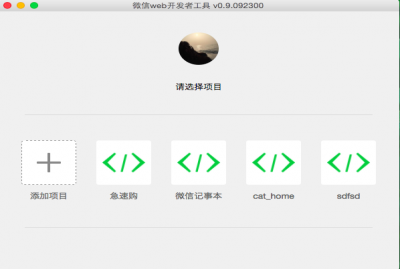
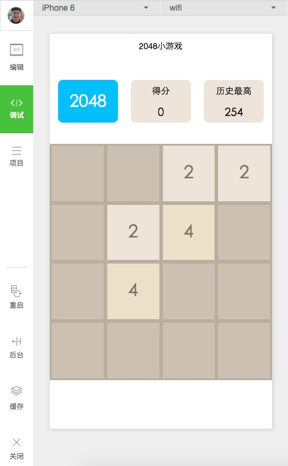

# 微信小程序开发资源
## 视频教程
- [［极客学院］从基础到实战](http://www.jikexueyuan.com/zhiye/course/34.html?type=8&utm_source=jike&utm_medium=www_index_cf&utm_campaign=wechat_app&utm_content=0930)

- [微信小程序开发实战第二季](http://edu.csdn.net/course/detail/3045)

- [你不知道的微信小程序](http://edu.csdn.net/course/detail/3022)

- [微信小程序开发实战](http://edu.csdn.net/course/detail/3011)

- [微信小程序实战教程](http://edu.csdn.net/course/detail/3009)

- [微信小程序项目实战](http://edu.csdn.net/course/detail/3019)

***
## 开源项目
- [DoubanBookApp 豆瓣图书](https://github.com/oopsguy/WechatSmallApps)－－高仿豆瓣读书
- [AppleMusic](https://github.com/Sioxas/AppleMusic)--微信小程序，仿Apple Music
- [WechatSmallApps](https://github.com/oopsguy/WechatSmallApps)--豆瓣图书
- [wechat-app-music](https://github.com/eyasliu/wechat-app-music)--微信小程序：音乐播放器
- [wxapp_ToDo](https://github.com/maczyt/wxapp_ToDo)--微信小程序のToDolist
- [SmallAppForQQ](https://github.com/GeekLiB/SmallAppForQQ)--微信小程序高仿QQUI

- [wechat-app-zhihudaily](https://github.com/GeekLiB/wechat-app-zhihudaily)--微信小程序版的知乎日报
 
- [weapp-gold](https://github.com/GeekLiB/weapp-gold)--微信小程序的掘金信息流 

- [weapp-weipiao](https://github.com/GeekLiB/weapp-weipiao)--微信小程序-微票
- [WeApp](https://github.com/liujians/WeApp)--微信UI

- [wxapp-hiapp](https://github.com/BelinChung/wxapp-hiapp)
- [timer](https://github.com/kraaas/timer)--时钟
- [wechat-weapp-gank](https://github.com/lypeer/wechat-weapp-gank)--Gank 客户端
- [weapp-newsapp](https://github.com/hijiangtao/weapp-newsapp)--微信小程序-公众号热门文章信息流

- [wechat-v2ex](https://github.com/jectychen/wechat-v2ex)--微信小程序-v2ex
- [wechat-weapp-demo](https://github.com/SeptemberMaples/wechat-weapp-demo)--一个简单的微信小程序购物车DEMO
- [wechat-app-2048](https://github.com/jeffche/wechat-app-2048)--2048小游戏 微信小程序开发 wechat weapp

- [weapp-douban-film](https://github.com/hingsir/weapp-douban-film)--微信小程序-豆瓣电影
- [weapp-demo](https://github.com/zce/weapp-demo)--微信小程序（应用号）示例教程（豆瓣电影）

## 文档
- [官方文档](http://wxopen.notedown.cn/)
***
## 文章

-  [未来是h5的：写在微信应用号发布之际(CNode)](https://cnodejs.org/topic/57e330d07d8293463a01e7e0)
-  [微信“小程序”让我脑洞大开(简书)](http://www.jianshu.com/p/60c8fd8d6862)
-  [关于微信小程序（应用号）的底层逻辑分析和拥抱建议(知乎专栏)](https://zhuanlan.zhihu.com/p/22565340)
-  [开发微信小程序的必备技能图谱(CSDN)](http://geek.csdn.net/news/detail/103138)
-  [微信小程序和谷歌PWA有什么关系？(微信公众号)](http://mp.weixin.qq.com/s?__biz=MzAwODY4OTk2Mg==&mid=2652039482&idx=2&sn=778e1313ebbd832b590b81a8088b63db#rd)
-  [在微信小程序里，我们要怎样做数据分析（上）(微信公众号)](http://mp.weixin.qq.com/s?__biz=MzI0ODU0MDg0Mw==&mid=2247483754&idx=1&sn=9578311da11d1fd3889e0829505c3993&scene=2&srcid=0924io6H1CmEPGYJxmEQVtlA)
-  [一张图看微信小程序(前端之路 - DRY)](http://zhenhua-lee.github.io/manmage/wx.html)
-  [微信小程序要这样解读](http://blog.csdn.net/yanzhenjie1003/article/details/52698184)
***
## 工具

-  [微信小程序 (应用号) 微信 web 开发者工具破解版(DiyCode)](http://www.diycode.cc/topics/308)
-  [微信小程序配置及目录在线生成工具](https://weapptool.com)
-  [IDE + 破解 + Demo(gavinkwoe/weapp-ide-crack)](https://github.com/gavinkwoe/weapp-ide-crack)

***

## 教程
-  [首个微信小程序开发教程(掘金)](http://gold.xitu.io/entry/57e34d6bd2030900691e9ad7)
-  [微信小程序开发教程！(稀土区)](http://xituqu.com/508.html)
-  [微信小程序怎么开发？玩物志用一个上午上线了电商应用(爱范儿)](http://www.ifanr.com/721124)
-  [开发微信小程序入门前(LatteCake)](http://lattecake.com/post/20098)
-  [小程序来临，前端工程师的春天(简书)](http://www.jianshu.com/p/fc958b73441a)
-  [hello-weapp 微信小程序最简示例教程(dingyiming/weapp-example)](https://github.com/dingyiming/weapp-example)
-  [微信小应用IDE的安装以及安装过程的常见问题(champion32/WeAppIdeIssue)](https://github.com/champion32/WeAppIdeIssue)
-  [分享我用cnode社区api做微信小应用的入门过程(CNode)](https://cnodejs.org/topic/57ea257b3670ca3f44c5beb6)
-  [微信小程序开发教程-从零开始(简书)](http://www.jianshu.com/p/aaef5ceb3936)
